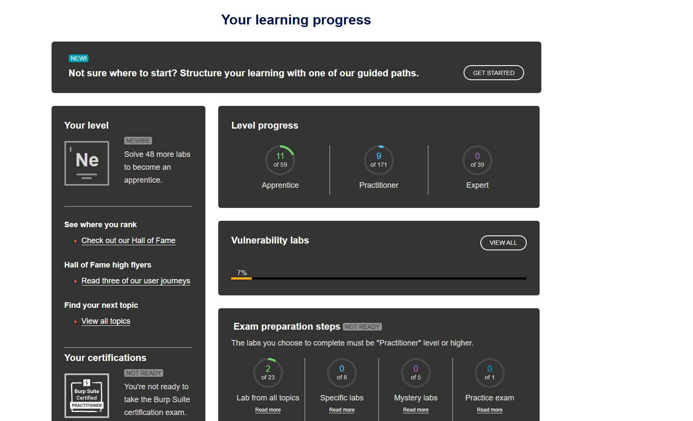

# Final assignment for the project and course - Casper Örnberg NTIS22K 

## Cisco - Introduction to Cybersecurity

Course was more like just recap of previous knowledge. I've had CCNA courses via Cisco, so there has been briefly from the cybersecurity aspect as well.
Inrtoduction to cybersecurity course had some basics on how to prevent them from happening, and guidance how to protect your and organization data, recognize some threats and common phishing types for example.
Course also had basics of devices related to cybersecurity and technologies.
I can't access the material anymore, since I completed it months ago, but if I recall correctly it was just basics what we've been learning across other courses as well.

 
 

## Portswigger

 
 

## The Booking System project
 
### Phase 1

### Phase 2

### Phase 3

### Phase 4

### Reflection of the booking system projet

## Logbook

### Total hours
### Hours per topic / link to logbook?

## (optioonal) Feedback
